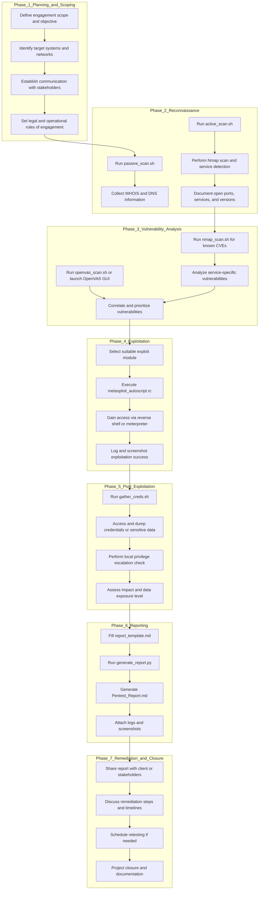

# InfiltraX
Red team-ready framework to identify, exploit, and document network vulnerabilities.

## Visual Pipeline

```mermaid
graph TD

%% === Phase 1: Planning and Target Scoping ===
subgraph Phase_1_Planning_and_Scoping
    A1[Define engagement scope and objective]
    A2[Identify target systems and networks]
    A3[Establish communication with stakeholders]
    A4[Set legal and operational rules of engagement]

    A1 --> A2
    A2 --> A3
    A3 --> A4
end

%% === Phase 2: Reconnaissance (reconnaissance/) ===
subgraph Phase_2_Reconnaissance
    B1[Run passive_scan.sh]
    B2[Collect WHOIS and DNS information]
    B3[Run active_scan.sh]
    B4[Perform Nmap scan and service detection]
    B5[Document open ports, services, and versions]

    B1 --> B2
    B3 --> B4
    B4 --> B5
end

%% === Phase 3: Vulnerability Analysis (vulnerability/) ===
subgraph Phase_3_Vulnerability_Analysis
    C1[Run nmap_scan.sh for known CVEs]
    C2[Analyze service-specific vulnerabilities]
    C3[Run openvas_scan.sh or launch OpenVAS GUI]
    C4[Correlate and prioritize vulnerabilities]

    C1 --> C2
    C3 --> C4
    C2 --> C4
end

%% === Phase 4: Exploitation (exploitation/) ===
subgraph Phase_4_Exploitation
    D1[Select suitable exploit module]
    D2[Execute metasploit_autoscript.rc]
    D3[Gain access via reverse shell or meterpreter]
    D4[Log and screenshot exploitation success]

    D1 --> D2
    D2 --> D3
    D3 --> D4
end

%% === Phase 5: Post Exploitation (post_exploitation/) ===
subgraph Phase_5_Post_Exploitation
    E1[Run gather_creds.sh]
    E2[Access and dump credentials or sensitive data]
    E3[Perform local privilege escalation check]
    E4[Assess impact and data exposure level]

    E1 --> E2
    E2 --> E3
    E3 --> E4
end

%% === Phase 6: Reporting (reporting/) ===
subgraph Phase_6_Reporting
    F1[Fill report_template.md]
    F2[Run generate_report.py]
    F3[Generate Pentest_Report.md]
    F4[Attach logs and screenshots]

    F1 --> F2
    F2 --> F3
    F3 --> F4
end

%% === Phase 7: Remediation and Closure ===
subgraph Phase_7_Remediation_and_Closure
    G1[Share report with client or stakeholders]
    G2[Discuss remediation steps and timelines]
    G3[Schedule retesting if needed]
    G4[Project closure and documentation]

    G1 --> G2
    G2 --> G3
    G3 --> G4
end

A4 --> B1
B5 --> C1
C4 --> D1
D4 --> E1
E4 --> F1
F4 --> G1
```
